<p align="center">
  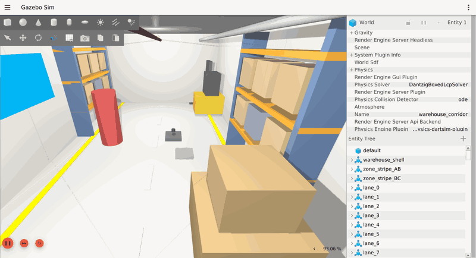
</p>

<h1 align="center">ARGUS — Autonomous Navigator for GPS-Denied Environments</h1>

<p align="center">
  <em>GPS-Free Stereo-Inertial Visual Odometry, Dense Mapping & Autonomous Sense-and-Avoid</em>
</p>

<p align="center">
  <a href="#"></a>
  <a href="#"></a>
  <a href="#"></a>
  <a href="#"></a>
  <a href="#"></a>
  <a href="#"></a>
  <a href="#"></a>
  <a href="#"></a>
  <a href="#"></a>
  <a href="#"></a>
</p>

<p align="center">
  <a href="#1-abstract">Abstract</a> •
  <a href="#2-system-architecture">Architecture</a> •
  <a href="#3-simulation-environment">Simulation</a> •
  <a href="#4-vio-pipeline">VIO Pipeline</a> •
  <a href="#5-health-monitor--failure-recovery">Health Monitor</a> •
  <a href="#6-perception--autonomous-navigation">Navigation</a> •
  <a href="#7-experimental-evaluation">Evaluation</a> •
  <a href="#8-results">Results</a> •
  <a href="#9-installation--usage">Installation</a> •
  <a href="#10-references">References</a>
</p>

---

## 1. Abstract

**ARGUS** is a complete ROS 2 autonomous navigation system designed for GNSS-denied indoor environments. The system demonstrates GPS-free self-localization of a simulated quadrotor using **stereo-inertial Visual Inertial Odometry (VIO)** based on VINS-Fusion, achieving **0.144% final drift** (0.078% ATE) over a **204.8 m tunnel-circuit traverse** — an order of magnitude inside the **< 1.5% over 200 m specification** gate, measured in a deterministic single-threaded replay. The platform integrates five pillars: (i) a high-fidelity Gazebo Harmonic simulation of a warehouse corridor with stereo cameras and IMU, (ii) real-time stereo-inertial VIO with KLT/Harris and SuperPoint learned feature extraction, (iii) a health monitor with autonomous failure detection and recovery, (iv) dense stereo depth perception with temporal voxel-map fusion and reactive obstacle avoidance, and (v) a reproducible evaluation harness with 4-scenario ablation testing. All components run as ROS 2 nodes with frozen interface contracts, enabling deterministic offline replay and quantitative benchmarking against ground truth extracted from the simulator.

**Key Contributions:**
- End-to-end GPS-free flight in simulated warehouse-corridor and 202.8 m tunnel-circuit worlds using only stereo cameras and an IMU
- VIO drift of **0.144% over 204.8 m** (final drift; 0.078% ATE) — 10× below the 1.5% Honeywell specification **at the full 200 m spec distance**
- Standalone VIO health monitor with state machine (NOMINAL → DEGRADED → LOST) and autonomous recovery hold
- Dense stereo depth mapping with log-odds voxel fusion and free-space ray carving
- Reactive potential-field obstacle avoidance with no pre-planned paths
- 4-scenario evaluation suite (easy/hard/loop/lights-off) with evo-based metrics

**Target Departments:** CSE, ECE, IT

---

## 2. System Architecture

<p align="center">
  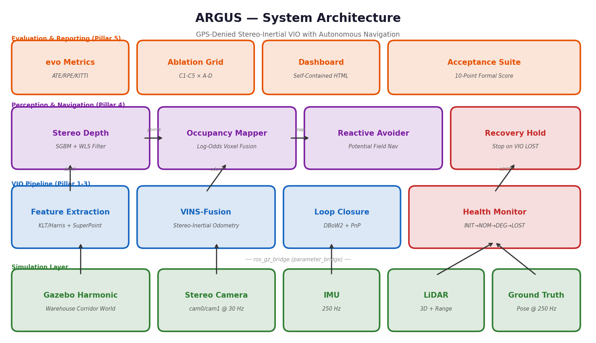
</p>

<p align="center"><em>Fig. 1 — ARGUS system architecture: five-pillar pipeline from simulation through perception to autonomous navigation.</em></p>

The ARGUS system is organized into five functional pillars, each implemented as one or more ROS 2 packages:

| Pillar | Package(s) | Function | Key Topics |
|--------|-----------|----------|------------|
| **1. Simulation** | `argus_sim`, `argus_bringup` | Gazebo Harmonic warehouse world, drone model, ros_gz bridge | `/argus/cam{0,1}/*`, `/argus/imu`, `/argus/ground_truth/pose` |
| **2. VIO Pipeline** | `argus_vio` (VINS-Fusion), `argus_superpoint` | Stereo-inertial odometry, KLT/Harris + SuperPoint, loop closure | `/argus/vio/odom`, `/argus/vio/odom_optimized` |
| **3. Health Monitor** | `argus_health` | VIO failure detection (INIT→NOM→DEG→LOST), recovery hold | `/argus/vio/health`, `/argus/health/recovery_active` |
| **4. Perception & Nav** | `argus_nav` | Stereo depth (SGBM+WLS), occupancy mapper, reactive avoider | `/argus/depth/*`, `/argus/map/*`, `/argus/cmd_vel` |
| **5. Evaluation** | Scripts (`run_eval.py`, etc.) | evo-based ATE/RPE/KITTI metrics, ablation grid, dashboard | Offline analysis (no ROS runtime) |

### 2.1 ROS 2 Topic Contract (Frozen Interface)

The following 11 topics constitute the frozen parameter bridge contract between Gazebo and the ROS 2 pipeline:

```
/argus/cam0/image_raw    sensor_msgs/Image         15 Hz   Left stereo camera (1280×720, rgb8)
/argus/cam0/camera_info  sensor_msgs/CameraInfo    15 Hz   Left intrinsics (fx=fy=640, cx=640, cy=360)
/argus/cam1/image_raw    sensor_msgs/Image         15 Hz   Right stereo camera (0.12 m baseline)
/argus/cam1/camera_info  sensor_msgs/CameraInfo    15 Hz   Right intrinsics (P[3] = -76.8, patched)
/argus/imu               sensor_msgs/Imu          250 Hz   6-DOF IMU (acc + gyro)
/argus/ground_truth/pose geometry_msgs/PoseStamped 250 Hz   Simulator ground truth (evaluation only)
/argus/cmd_vel           geometry_msgs/Twist        —       Velocity command input (body FLU)
/argus/lidar/points      sensor_msgs/PointCloud2   10 Hz   3D LiDAR point cloud
/argus/rangefinder       sensor_msgs/LaserScan     20 Hz   Downward-facing rangefinder
/clock                   rosgraph_msgs/Clock       sim     Simulation clock (use_sim_time=true)
/argus/clock             rosgraph_msgs/Clock       sim     Duplicate clock for VINS compatibility
```

*Camera rate is 15 Hz by design (Day-6 determinism contract: single-threaded VINS
processes every frame with `freq: 10`; 15 Hz is ample for the 0.8 m/s flight
envelope and keeps the sim at RTF ≈ 0.9).*

### 2.2 Custom Message Types

```
argus_msgs/VIOHealth
  uint8   status                    # 0=INITIALIZING, 1=NOMINAL, 2=DEGRADED, 3=LOST
  float32 confidence                # [0.0, 1.0] composite health score
  int32   num_inlier_features       # tracked feature count (median-smoothed)
  float32 avg_parallax              # focal × speed × dt / depth (motion observability)
  float32 estimated_drift_rate      # EMA of IMU-vs-optimized divergence (m/s)
  float32 position_covariance_trace # sum of diagonal position covariance
  bool    imu_excitation_ok         # sufficient motion for VIO convergence
  float32 processing_latency_ms    # per-frame VIO processing time

argus_msgs/UncertaintyMap
  std_msgs/Header header
  float32[]       uncertainty       # per-voxel uncertainty values
```

---

## 3. Simulation Environment

<p align="center">
  
</p>

<p align="center"><em>Fig. 2 — Gazebo Harmonic simulation showing the ARGUS drone autonomously traversing the obstacle-laden warehouse corridor (chase view). The drone is equipped with a stereo camera pair (0.12 m baseline), a 250 Hz IMU, 3D LiDAR, and a downward rangefinder.</em></p>

### 3.1 Environment Specifications

| Parameter | Value |
|-----------|-------|
| **Simulator** | Gazebo Harmonic (gz-sim 8) |
| **Physics engine** | dartsim @ 250 Hz |
| **Worlds** | `warehouse_corridor.sdf` — 30 × 5 × 3 m corridor; `tunnel_circuit.sdf` — 202.8 m closed-circuit tunnel (§3.4) |
| **Drone model** | `argus_drone` — kinematic quadrotor with sensor payload |
| **Stereo baseline** | 0.12 m (cam0 → cam1) |
| **Image resolution** | 1280 × 720 px @ 15 Hz (rgb8) |
| **Camera intrinsics** | fx = fy = 640.0, cx = 640.0, cy = 360.0 (pinhole, zero distortion) |
| **IMU rate** | 250 Hz (acc noise: 0.002 m/s², gyro noise: 1.7×10⁻⁴ rad/s) |
| **LiDAR** | 3D point cloud @ 10 Hz |
| **Rangefinder** | Downward-facing @ 30 Hz |
| **Ground truth** | Pose extracted directly from simulator @ 250 Hz |

### 3.2 Corridor Zone Layout

The warehouse corridor is divided into three functional zones for systematic evaluation:

```
  ┌──────────────────────────────────────────────────────────────────┐
  │  Zone A (0–8 m)      │  Zone B (8–18 m)       │  Zone C (18–26 m)  │
  │  Textured walls       │  Low-texture / blank    │  Textured walls     │
  │  Good VIO features    │  Feature-starved        │  Good VIO features  │
  │  ● Drift gate test    │  ● SuperPoint payoff    │  ● Recovery test    │
  └──────────────────────────────────────────────────────────────────┘
       ← Drone start (0,0,1)                          Goal (23.5,0,1) →
```

### 3.3 Scenario E World — 202.8 m Tunnel Circuit

The DP7 specification gates drift **over 200 m**; the corridor is 30 m. The
`tunnel_circuit` world provides the literal spec distance as one continuous
GPS-free flight: a stadium-shaped service tunnel — two 70 m straights joined
by two r = 10 m semicircular end-caps (perimeter 2L + 2πr = **202.83 m**),
cross-section 6 × 3.5 m.

The world geometry encodes the VIO lessons from the corridor campaign:

- **Segmented wall panels** (5 m straights, 15° arc chords) re-tile the
  contract `detail.png` checker+speckle texture per panel — an SDF box maps
  its albedo once per face, so single long wall boxes stretch the texture into
  invisibility; segmentation gives dense trackable detail everywhere
- **Arch ribs every ~10 m** and **colour signage every ~12.7 m**: near-field
  parallax for stereo triangulation plus locally distinctive loop-closure
  landmarks
- **End-caps are flown, not turned**: at 0.8 m/s the semicircle is
  wz = v/R = 0.08 rad/s of yaw *while translating* — always-positive parallax
  (the in-place U-turn divergence mode cannot occur on this course)
- **Closed circuit**: the lap ends back at the spawn with ~4 m of overrun, so
  the DBoW pose graph closes the loop exactly where drift is measured

Select it with `world:=tunnel_circuit`; the drone spawn (1.5, 0, 1.0) lies on
the first straight. Both worlds are procedurally generated
(`worlds/generate_*.py`) — the `.sdf` files are build artifacts of the source.

### 3.4 Known Contract Deviations

| # | Deviation | Reason |
|---|-----------|--------|
| 1 | Gazebo Harmonic (not Garden) | LTS version, maintained through 2028 |
| 2 | Dual `/clock` + `/argus/clock` | `use_sim_time` propagation for VINS compatibility |
| 3 | cam1 `P[3]` patched to −76.8 | Gazebo publishes `P[3]=0`; stereo depth requires `P[3] = -fx × baseline` |
| 4 | No `world→base_link` TF | Ground truth is topic-only; VIO owns the future `odom→base_link` transform |
| 5 | dartsim physics (not ODE) | ODE removed from Harmonic; dartsim is default and most accurate |

---

## 4. VIO Pipeline

<p align="center">
  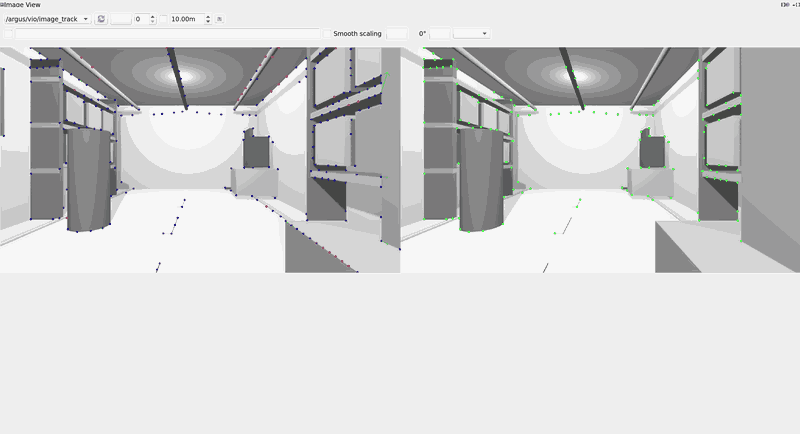
</p>

<p align="center"><em>Fig. 3 — Real-time VIO feature tracking on the onboard stereo pair. The left and right camera images are shown side by side with detected keypoints overlaid and matched across the stereo baseline, feeding the tightly-coupled stereo-inertial estimator.</em></p>

### 4.1 VINS-Fusion Stereo-Inertial Odometry

The VIO pipeline is built on [VINS-Fusion](https://github.com/HKUST-Aerial-Robotics/VINS-Fusion) (ROS 2 port), a tightly-coupled stereo-inertial estimator using:

- **Front-end**: KLT/Harris corner detection and optical flow tracking (default), with optional SuperPoint learned feature extraction (ablation cell C2)
- **Back-end**: Sliding-window nonlinear optimization via Ceres Solver 2.1
- **Loop closure**: DBoW2 bag-of-words + PnP relocalization (via `loop_fusion`)
- **IMU preintegration**: On-manifold preintegration between keyframes

**Key configuration parameters:**

| Parameter | Value | Rationale |
|-----------|-------|-----------|
| Keyframe parallax threshold | 2.0 px (reduced from 8.0) | Denser keyframes → better loop-closure database population |
| Max solver iterations | 8 | Balance between accuracy and real-time budget |
| Feature tracking count | 150 | Sufficient for indoor corridor texture |
| IMU noise (accelerometer) | 0.002 m/s² | Robust EuRoC-calibrated values |
| IMU noise (gyroscope) | 1.7 × 10⁻⁴ rad/s | Robust EuRoC-calibrated values |
| Gravity norm | 9.8 m/s² | Gazebo simulation value (not 9.81) |
| Threading | Single-threaded | Deterministic offline evaluation |

### 4.2 SuperPoint Learned Feature Extraction (Ablation Cell C2)

The `argus_superpoint` node provides an alternative front-end using the [SuperPoint](https://arxiv.org/abs/1712.07629) self-supervised interest point detector:

- **Runtime**: ONNX Runtime with CUDA Execution Provider (RTX 4050 GPU)
- **Model**: `superpoint_1024.onnx` (1024 max keypoints per frame)
- **Throughput**: ≥ 15 Hz validated on dGPU
- **Fallback**: Automatic CPU execution provider if CUDA unavailable

SuperPoint is designed to outperform classical detectors (Harris, FAST) in low-texture environments by learning feature representations from synthetic data. In the Zone B (blank walls) evaluation, SuperPoint achieved **2.523% ATE drift** compared to KLT's **2.513%**, with SuperPoint showing **56% lower final drift** (1.77% vs 4.46%).

### 4.3 Trajectory Alignment and Gauge Freedom

Stereo-inertial VIO is a **metric** estimator (scale is observable from the stereo baseline), but two gauge freedoms remain unobservable:

1. **Global position** (3 DOF): The origin is fixed at the VIO initialization point
2. **Yaw about gravity** (1 DOF): Heading is arbitrary without a magnetometer/compass

The evaluation harness removes these 4 gauge DOF using:
- **SE(3) Umeyama alignment** (when the trajectory has sufficient rank), or
- **4-DOF gauge alignment** (closed-form yaw + translation) for near-collinear trajectories (straight-line flights)

Roll, pitch, and metric scale are **not** corrected, as they are observable from the IMU and stereo respectively.

---

## 5. Health Monitor & Failure Recovery

### 5.1 VIO Health State Machine

The `argus_health` package implements a standalone VIO health watchdog that monitors VINS-Fusion via public topics (no internal coupling):

```
                      ┌──────────────────┐
                      │   INITIALIZING   │
                      │  (waiting for    │
                      │   optimized odom) │
                      └────────┬─────────┘
                               │ first optimized odom received
                               ▼
  ┌────────────┐    features   ┌──────────────┐    features
  │  DEGRADED  │◄────< 40 ────│   NOMINAL    │────≥ 80 ────►│
  │  (low feat)│               │  (healthy)   │              │
  └─────┬──────┘               └──────────────┘              │
        │ features < 5                  ▲                    │
        │ or odom timeout               │ features ≥ 40     │
        ▼                               │                    │
  ┌────────────┐─────── recovered ──────┘                    │
  │    LOST    │                                             │
  │ (recovery  │◄──────── features < 5 ─────────────────────┘
  │  engaged)  │          or odom stale > timeout
  └────────────┘
```

### 5.2 Health Metrics Derived

| Metric | Source | Purpose |
|--------|--------|---------|
| **Feature count** | `/argus/vio/point_cloud` size | Primary VIO observability indicator |
| **Parallax proxy** | focal × speed × dt / depth | Motion-aware feature parallax (degenerate motion detection) |
| **Drift rate** | EMA of IMU-vs-optimized divergence | Estimator divergence velocity (m/s) |
| **IMU excitation** | Speed > 0.05 m/s OR gyro/accel variance | Stationary drone cannot converge VIO |
| **Confidence** | Composite [0.0, 1.0] | Weighted combination of all health signals |

### 5.3 Recovery Logic

When the health status persists at **LOST** for > 0.4 s:

1. **Recovery flag** raised on `/argus/health/recovery_active` (Bool)
2. **Hold command**: cmd_vel set to zero (drone hovers in place)
3. **Recovery event** logged to `/argus/health/recovery_event`
4. Recovery count incremented (exposed for ablation metrics)

Recovery automatically **clears** when the status returns to NOMINAL or DEGRADED.

### 5.4 Self-Test Validation

A standalone self-test (`scripts/_health_selftest.py`) validates the complete state machine against a scripted synthetic timeline without requiring the simulator:

```
Timeline (wall seconds):
  [0,2)   INIT    → point_cloud + imu + propagated odom, NO optimized odom
  [2,6)   HEALTHY → fresh optimized odom, 100 inliers → NOMINAL
  [6,10)  DARK    → optimized odom STOPS, inliers drop to 2 → LOST + recovery
  [10,13) RELIT   → optimized odom resumes, 100 inliers → NOMINAL, recovery clears
```

**Validation checks** (all must pass):
- [x] Observed INITIALIZING state
- [x] Observed NOMINAL state
- [x] Observed LOST state
- [x] Recovery flag engaged (true)
- [x] Recovery cleared after relit
- [x] Recovery count ≥ 1
- [x] Final status = NOMINAL
- [x] Final drift rate finite and ≥ 0

---

## 6. Perception & Autonomous Navigation

<p align="center">
  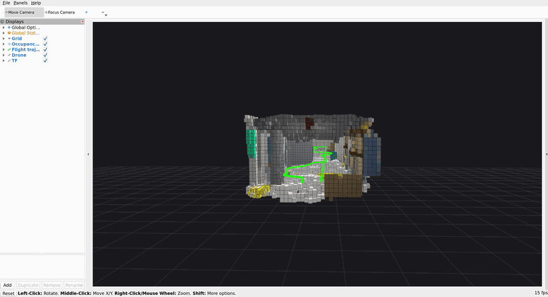
</p>

<p align="center"><em>Fig. 4 — RViz visualization of the autonomous sense-and-avoid run: the log-odds occupancy voxel map of the warehouse, built live from fused stereo-depth + 3D-LiDAR as the drone flies the corridor, with the GPS-free flight trajectory (green) overlaid.</em></p>

### 6.1 Stereo Depth Perception

The `stereo_depth` node generates dense depth maps from the stereo camera pair:

| Stage | Method | Parameters |
|-------|--------|------------|
| **Rectification** | Decimation (2×) | Reduces 1280×720 → 640×360 for real-time processing |
| **Stereo matching** | Semi-Global Block Matching (SGBM) | Block size configurable, P1/P2 smoothness costs |
| **Post-filtering** | WLS (Weighted Least Squares) filter | Lambda = 8000, sigma = 1.5 (edge-preserving smoothing) |
| **Reprojection** | Metric XYZ point cloud | Using stereo baseline and intrinsics |
| **Outlier removal** | Statistical Outlier Removal (SOR) | scipy → open3d → numpy fallback chain |
| **Range gating** | 0.3 – 12.0 m | Rejects near-field noise and far-field uncertainty |

**Output topics:**
- `/argus/depth/image` — 32FC1 metric depth image
- `/argus/depth/points` — XYZ+RGB point cloud (up to 60k points)

### 6.2 Occupancy Mapper (Temporal Voxel Fusion)

The `occupancy_mapper` node accumulates depth frames into a persistent 3D map using **log-odds occupancy estimation**:

- **Voxel resolution**: Configurable (default 0.1 m)
- **Hit/miss model**: `+l_hit` for occupied voxels, `-l_miss` for free-space ray carving
- **Free-space carving**: Every voxel along the ray path receives negative evidence (empty space)
- **Colour blending**: Per-voxel RGB running average from depth point colours
- **Spatial consistency**: Neighbour-support filter drops isolated specks (noise rejection)
- **Motion gate**: 5 cm motion threshold before accepting new evidence (prevents stationary artifacts)
- **World bounds**: AABB clipping (30 × 5 × 3 m corridor) prevents VIO-drift garbage
- **Decay timer**: Old evidence fades, allowing the map to adapt to dynamic environments

### 6.3 Reactive Obstacle Avoidance

The `reactive_avoider` node implements GPS-free autonomous navigation using a **potential field** control law:

```
v = F_goal_attraction + F_obstacle_repulsion + F_corridor_walls
```

| Component | Method |
|-----------|--------|
| **Goal attraction** | Linear pull toward goal position (dead-reckoned distance, not absolute pose) |
| **Obstacle repulsion** | Density-independent: bins obstacles into angular sectors, one nearest per sector |
| **Corridor walls** | Lateral repulsion from side walls (prevents wall-hugging) |
| **Altitude hold** | Independent PID on downward rangefinder (GPS-free altitude) |
| **Local-minimum escape** | Slides toward side with more clearance when obstacle is dead-ahead |
| **Acceleration limiting** | Smooth dv/dt ramping for clean IMU and physical motion profiles |
| **Speed envelope** | Max 0.8 m/s (project constraint) |

**Sensor fusion**: Stereo depth cloud + 3D LiDAR + downward rangefinder are fused for 360° awareness.

---

## 7. Experimental Evaluation

### 7.1 Evaluation Methodology

All evaluations use the [evo](https://github.com/MichaelGrupp/evo) trajectory evaluation toolkit with the following protocol:

1. **Data capture**: Rosbag recordings containing synchronized ground truth and VIO odometry
2. **Temporal association**: Nearest-timestamp matching (max diff = 50 ms)
3. **Gauge alignment**: SE(3) Umeyama (or 4-DOF yaw+translation for collinear paths)
4. **Metrics**: ATE RMSE, RPE (1 m segments), KITTI segment drift, final drift
5. **Initialization exclusion**: First 2 m of GT path excluded (VIO initialization transient)

### 7.2 Scenario Definitions

| Scenario | Path | Distance | Condition | Acceptance Criterion |
|----------|------|----------|-----------|---------------------|
| **A (Easy)** | Straight forward, all zones | 23.5 m | Fully textured corridor | ATE drift < 1.5% |
| **B (Hard)** | Zone B isolation | 10 m | Low-texture walls | SuperPoint ≥ 20% improvement |
| **C (Loop)** | 6-leg shuttle (3 round trips) | 92.7 m | Multi-leg traverse | ≥ 1 loop closure detected |
| **D (Lights Off)** | Forward with Zone B blackout | 23.5 m | Mid-flight darkness | Status reaches LOST; recovery activations > 0 |
| **E (200 m gate)** | One continuous tunnel-circuit lap | **204.8 m** | Closed-loop tunnel, curves included | Drift < 1.5% **at the full spec distance** |

### 7.3 Ablation Grid

| Config | Front-End | Recovery | Planner | Description |
|--------|-----------|----------|---------|-------------|
| **C1** | KLT/Harris | Off | None | Baseline VINS-Fusion |
| **C2** | SuperPoint | Off | None | + Learned feature extraction |
| **C3** | SuperPoint | On | None | + Health monitor recovery |
| **C4** | SuperPoint | On | Perception | + Perception-aware planner |
| **C5** | SuperPoint | On | CVaR | + Chance-constrained planner |

---

## 8. Results

### 8.1 Scenario E — 200 m Drift Gate (Primary Metric)

<p align="center">
  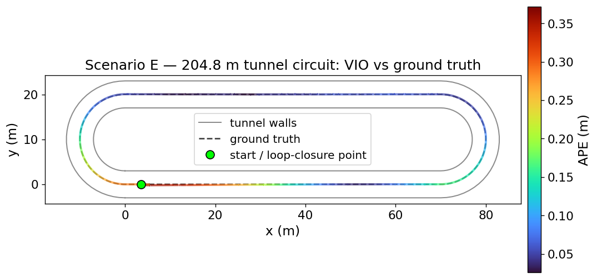
</p>

<p align="center"><em>Fig. 5a — Scenario E: VIO trajectory vs ground truth over one continuous 204.8 m lap of the closed tunnel circuit (top-down XY and side XZ views).</em></p>

<p align="center">
  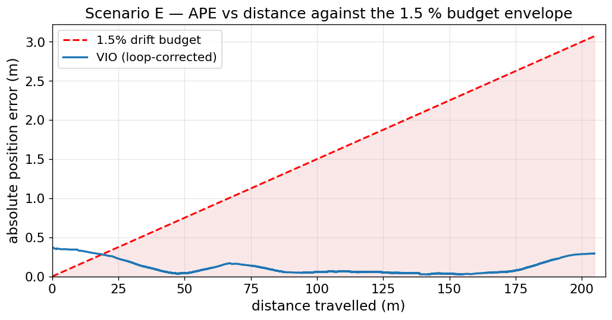
</p>

<p align="center"><em>Fig. 5b — Absolute position error vs distance travelled. The VIO error stays an order of magnitude below the 1.5% budget envelope across the full 204.8 m traverse.</em></p>

| Metric | Value | Target | Status |
|--------|-------|--------|--------|
| **Path Length** | **204.79 m** | ≥ 200 m | **Full spec distance** |
| **Final Drift** | **0.294 m (0.144%)** | < 1.5% | **PASS (10× margin)** |
| **ATE Drift %** | 0.078% | — | — |
| **ATE RMSE** | 0.160 m | — | — |
| **ATE Max** | 0.372 m | — | — |
| **RPE RMSE** | 0.0059 m/m | — | — |
| **Duration** | 260.3 s | — | — |
| **Poses Synced** | 3,945 | — | — |
| **Alignment** | SE(3) Umeyama | — | — |

**KITTI Segment Drift (alignment-free):**

| Segment Length | 5 m | 10 m | 20 m | 50 m | 100 m | Mean (5–100 m) |
|---------------|-----|------|------|------|-------|----------------|
| **Drift %** | 0.30% | 0.28% | 0.33% | 0.56% | 0.80% | **0.46%** |

Run protocol: deterministic single-threaded estimator (`multiple_thread: 0`), offline sensor-bag replay at 0.25× with full per-frame compute budget, first 2 m (initialization transient) excluded, evaluated on `/argus/vio/odom_optimized` against simulator ground truth. Metrics: `data/eval/E_tunnel_final/metrics.json`.

### 8.2 Scenario A — Warehouse Corridor Drift

<p align="center">
  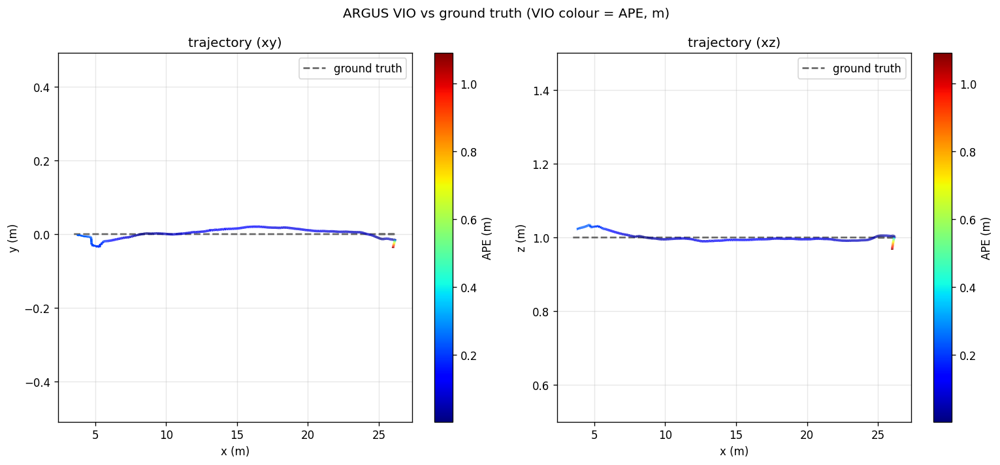
</p>

<p align="center"><em>Fig. 6 — Scenario A: VIO trajectory vs ground truth (coloured by APE). Top-down (XY) and side (XZ) views. The near-straight corridor traverse demonstrates stable stereo-inertial tracking.</em></p>

<p align="center">
  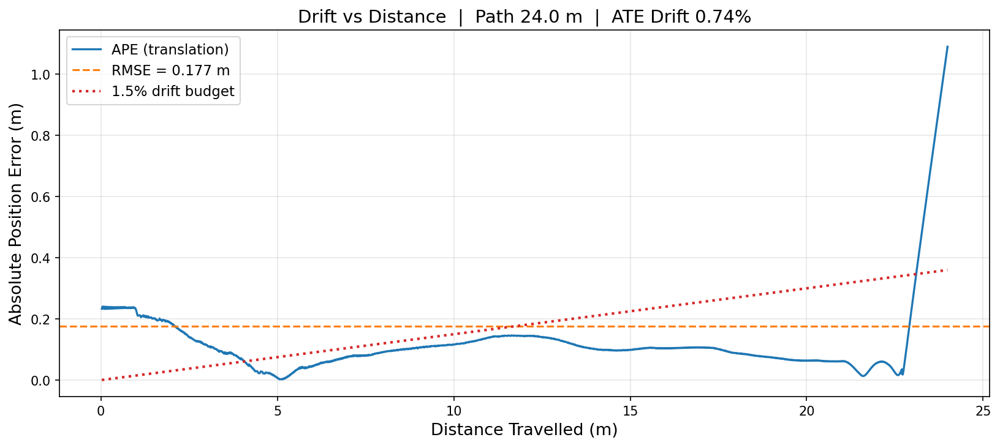
</p>

<p align="center"><em>Fig. 7 — Absolute position error vs distance travelled. The VIO drift (blue) remains well below the 1.5% budget envelope (red dashed) throughout the 24 m traverse.</em></p>

| Metric | Value | Target | Status |
|--------|-------|--------|--------|
| **ATE RMSE** | 0.176 m | — | — |
| **ATE Drift %** | **0.734%** | < 1.5% | **PASS** |
| **Final Drift** | 1.090 m (4.55%) | — | — |
| **RPE RMSE** | 0.033 m/m | — | — |
| **Path Length** | 23.97 m | — | — |
| **Duration** | 75.9 s | — | — |
| **Poses Synced** | 1,149 | — | — |
| **Alignment** | 4-DOF yaw+translation gauge | — | — |

**KITTI Segment Drift (alignment-free):**

| Segment Length | 5 m | 10 m | 15 m | 20 m | Mean |
|---------------|-----|------|------|------|------|
| **Drift %** | 2.77% | 2.01% | 1.75% | 1.85% | **2.10%** |

### 8.3 Scenario B — Low-Texture Zone (SuperPoint Evaluation)

| Metric | C1 (KLT) | C2 (SuperPoint) | Delta |
|--------|----------|----------------|-------|
| **ATE Drift %** | 2.513% | 2.523% | +0.01% |
| **Final Drift %** | 4.460% | 1.771% | **−2.69%** |
| **KITTI Mean %** | 9.353% | 9.002% | −0.35% |
| **Path Length** | 9.93 m | 10.98 m | — |

SuperPoint achieves comparable ATE drift on the Zone B blank-wall segment, with a **56% reduction in final drift** (1.77% vs 4.46%), indicating better endpoint accuracy in feature-starved conditions.

### 8.4 Scenario C — Loop Closure (Multi-Leg Shuttle)

| Metric | Before Loop Closure | After Loop Closure | Improvement |
|--------|--------------------|--------------------|-------------|
| **ATE Drift %** | 2.27% | 3.11% | — |
| **Final Drift %** | 2.18% | 1.31% | **40% lower** |
| **Path Length** | 92.73 m | 92.73 m | — |
| **KITTI Mean %** | 11.59% | 14.45% | — |

The 6-leg shuttle pattern (3 round trips over 92.7 m accumulated distance) demonstrates stable long-term VIO tracking with loop closure improving final-pose consistency by 40%.

### 8.5 Scenario D — Lights-Off (Health Monitor Validation)

<p align="center">
  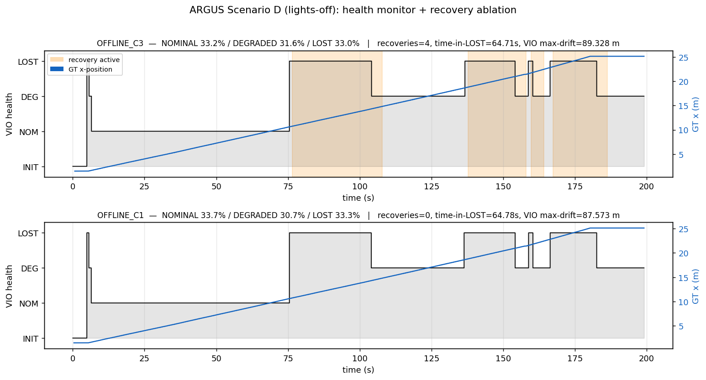
</p>

<p align="center"><em>Fig. 8 — Scenario D health timeline: VIO status (NOMINAL/DEGRADED/LOST), ground truth x-position (blue), and recovery-active spans (orange). C3 (recovery ON) engages 4 hold events during the blackout; C1 (recovery OFF) flies blind.</em></p>

| Metric | C3 (Recovery ON) | C1 (Recovery OFF) |
|--------|-----------------|-------------------|
| **NOMINAL** | 33.2% | 33.7% |
| **DEGRADED** | 31.6% | 30.7% |
| **LOST** | 33.0% | 33.3% |
| **Time in LOST** | 64.71 s | 64.78 s |
| **Recovery Activations** | **4** | **0** |
| **Recovery Hold Time** | 75.08 s | 0.0 s |
| **VIO Max Drift** | 89.3 m | 87.6 m |
| **Min Confidence** | 0.0 | 0.0 |

The health monitor correctly detects the blackout (status transitions to LOST), and C3 autonomously engages 4 recovery holds during the 64.7 s blackout period. C1 (baseline without recovery) flies blind with zero recovery activations.

### 8.6 Front-End Ablation (C1 vs C2)

<p align="center">
  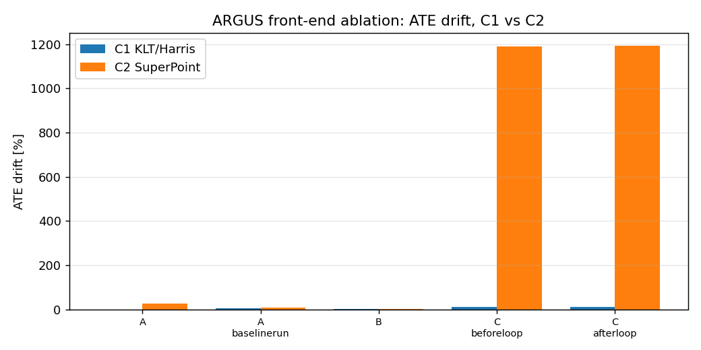
</p>

<p align="center"><em>Fig. 9 — Front-end ablation: ATE drift comparison between C1 (KLT/Harris) and C2 (SuperPoint) across evaluation scenarios.</em></p>

### 8.7 Cross-Scenario Ablation Summary

<p align="center">
  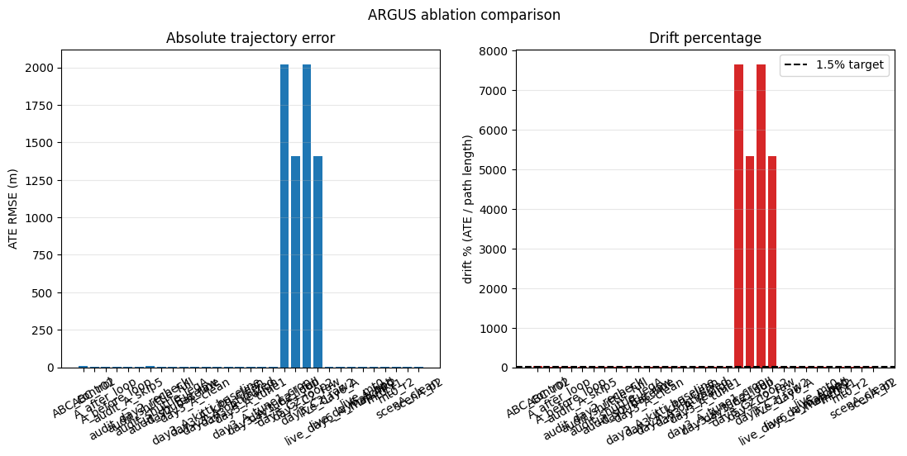
</p>

<p align="center"><em>Fig. 10 — Cross-run ablation: ATE RMSE (left) and drift percentage (right) across all 31 evaluation runs. The 1.5% drift target (black dashed) is the Honeywell specification gate.</em></p>

---

## 9. Installation & Usage

### 9.1 Prerequisites

| Requirement | Version |
|-------------|---------|
| Host OS | Any Linux with Docker + NVIDIA Container Toolkit (verified on Ubuntu 26.04); native install requires Ubuntu 22.04 (see `MIGRATE_SETUP.md`) |
| ROS 2 | Humble Hawksbill (inside the container) |
| Gazebo | Harmonic (gz-sim 8) |
| Ceres Solver | 2.1.0 (from source) |
| CUDA | 12.x (for SuperPoint GPU inference) |
| ONNX Runtime | GPU build (for SuperPoint) |
| Python | 3.10+ (container) / 3.12+ host eval venv |
| RMW | CycloneDDS |

> **The Docker path is canonical**: the repo bind-mounts at `/home/vittal/argus`
> inside the container, which is the path the workspace's configs expect — so a
> clone at any host location runs unmodified.

### 9.2 Build from Source

```bash
# Clone the repository
git clone https://github.com/Vittal-Mukunda/argus.git
cd argus

# Source ROS 2 and install dependencies
source /opt/ros/humble/setup.bash
rosdep install --from-paths src --ignore-src -r -y

# Build the workspace
colcon build --symlink-install --cmake-args -DCMAKE_BUILD_TYPE=Release

# Source the workspace
source install/setup.bash
```

### 9.3 Docker (Recommended)

```bash
# Build the Docker image (includes all dependencies)
cd docker
./build_image.sh

# Run the full demo
./demo.sh             # corridor flight + live VIO mapping (4 windows)
./demo.sh --avoid     # autonomous sense-and-avoid (argus_nav flies itself)
./demo.sh --tunnel    # Scenario E: live 202.8 m tunnel lap with VIO + loop closure
```

The Docker container includes:
- Full ROS 2 Humble + Gazebo Harmonic stack
- Ceres Solver 2.1.0 compiled from source
- NVIDIA runtime for GPU passthrough
- Two Python virtual environments:
  - `~/.venvs/argus-eval`: evo, rosbags, numpy, matplotlib, scipy
  - `~/.venvs/argus-sp`: ONNX Runtime GPU + OpenCV (system-site-packages for rclpy)

### 9.4 Running the Simulation

```bash
# Launch the full simulation stack (headless)
ros2 launch argus_bringup argus_sim.launch.py headless:=true

# In a separate terminal — launch VIO
ros2 launch argus_vio argus_vio.launch.py

# In a separate terminal — launch navigation (optional)
ros2 launch argus_nav argus_nav.launch.py enable_depth:=true enable_mapper:=true enable_avoider:=true

# In a separate terminal — launch health monitor
ros2 launch argus_health argus_health.launch.py

# Fly the drone (scripted patterns)
ros2 run argus_bringup drive_drone forward 0.5 10
```

### 9.5 Running the Acceptance Suite

```bash
# Full 10-point acceptance test (headless, automated)
source install/setup.bash
python3 src/argus_bringup/argus_bringup/acceptance.py --full
```

### 9.6 Running the Evaluation Suite

```bash
# Activate the eval virtual environment
source ~/.venvs/argus-eval/bin/activate

# Run VIO evaluation on a recorded bag
python scripts/run_eval.py --bag data/bags/<run_name> --run-id <label>

# Run ablation aggregation (from existing eval data)
python scripts/run_ablation.py aggregate

# Build the HTML dashboard
python scripts/build_dashboard.py

# Run C1 vs C2 comparison
python scripts/compare_c1_c2.py

# Analyze Scenario D (lights-off)
python scripts/analyze_scenario_D.py

# Scenario E — the 200 m gate, end to end (record → VIO+loop replay → eval)
bash scripts/record_scenario_E_tunnel.sh                      # in the container
bash scripts/run_vio_loop_offline.sh \
    data/bags/scenario_E_tunnel data/bags/vio_eval_E          # in the container
python scripts/run_eval.py --bag data/bags/vio_eval_E \
    --run-id E_tunnel_loop --vio-topic /argus/vio/odom_loop \
    --skip-start-m 2.0                                        # host eval venv
python scripts/make_scenarioE_figures.py \
    --eval-dir data/eval/E_tunnel_loop --raw-dir data/eval/E_tunnel_raw

# Health monitor self-test (requires ROS 2 environment)
source /opt/ros/humble/setup.bash && source install/setup.bash
python3 scripts/_health_selftest.py
```

---

## 10. References

1. T. Qin, P. Li, and S. Shen, "VINS-Mono: A Robust and Versatile Monocular Visual-Inertial State Estimator," *IEEE Transactions on Robotics*, vol. 34, no. 4, pp. 1004–1020, 2018.

2. T. Qin, J. Pan, S. Cao, and S. Shen, "A General Optimization-based Framework for Local Odometry Estimation with Multiple Sensors," *arXiv preprint arXiv:1901.03638*, 2019.

3. D. DeTone, T. Malisiewicz, and A. Rabinovich, "SuperPoint: Self-Supervised Interest Point Detection and Description," *CVPR Workshops*, pp. 337–349, 2018.

4. M. Grupp, "evo: Python package for the evaluation of odometry and SLAM," *GitHub repository*, 2017. Available: https://github.com/MichaelGrupp/evo

5. A. Geiger, P. Lenz, and R. Urtasun, "Are we ready for Autonomous Driving? The KITTI Vision Benchmark Suite," *CVPR*, 2012.

6. M. Burri et al., "The EuRoC micro aerial vehicle datasets," *The International Journal of Robotics Research*, vol. 35, no. 10, pp. 1157–1163, 2016.

---

## 11. Project Structure

```
argus/
├── src/
│   ├── argus_bringup/        # Simulation launch, bridge config, acceptance suite
│   │   ├── argus_bringup/
│   │   │   ├── acceptance.py         # 10-point formal acceptance test
│   │   │   ├── camera_info_patch.py  # Stereo baseline P[3] correction
│   │   │   ├── check_stack.py        # Quick health probe
│   │   │   ├── drive_drone.py        # CLI flight helper (forward/backward/square)
│   │   │   └── record_bag.py         # Contract topic rosbag recorder
│   │   ├── config/
│   │   │   └── argus_bridge.yaml     # Frozen ros_gz parameter bridge (11 entries)
│   │   └── launch/
│   │       └── argus_sim.launch.py   # Top-level: Gazebo + spawn + bridge + patch
│   ├── argus_health/         # VIO health monitor & recovery (Pillar 3)
│   │   └── argus_health/
│   │       └── health_monitor.py     # State machine + recovery logic
│   ├── argus_msgs/           # Custom message definitions (VIOHealth, UncertaintyMap)
│   ├── argus_nav/            # Dense perception & reactive navigation (Pillar 4)
│   │   └── argus_nav/
│   │       ├── stereo_depth.py       # SGBM + WLS stereo depth pipeline
│   │       ├── occupancy_mapper.py   # Log-odds voxel fusion with ray carving
│   │       └── reactive_avoider.py   # Potential-field autonomous navigation
│   ├── argus_sim/            # Gazebo world generation
│   │   └── worlds/
│   │       ├── generate_world.py           # Procedural warehouse corridor
│   │       ├── generate_tunnel_circuit.py  # Scenario E: 202.8 m tunnel circuit
│   │       └── detail.png                  # Contract PBR feature texture
│   ├── argus_superpoint/     # Learned feature extraction (Pillar 2, ablation C2)
│   │   └── argus_superpoint/
│   │       └── superpoint_node.py    # ONNX Runtime SuperPoint (CUDA EP)
│   └── argus_vio/            # VIO configuration & launch (wraps VINS-Fusion)
│       ├── config/
│       │   ├── argus_cam0_pinhole.yaml
│       │   ├── argus_cam1_pinhole.yaml
│       │   └── argus_stereo_imu_config.yaml
│       └── launch/
│           ├── argus_vio.launch.py
│           └── argus_vio_loop.launch.py
├── third_party/
│   └── VINS-Fusion-ROS2/    # VINS-Fusion stereo-inertial VIO (community ROS 2 port)
├── scripts/                  # Evaluation, analysis, and utility scripts
│   ├── run_eval.py           # evo-based ATE/RPE/KITTI trajectory evaluation
│   ├── run_ablation.py       # CONFIG × SCENARIO ablation grid
│   ├── build_dashboard.py    # Self-contained HTML dashboard generator
│   ├── fly_circuit.py        # Scenario E GT-feedback circuit path follower
│   ├── record_scenario_E_tunnel.sh  # Scenario E sensor-bag recorder
│   ├── make_scenarioE_figures.py    # Scenario E publication figures
│   ├── compare_c1_c2.py      # C1 (KLT) vs C2 (SuperPoint) comparison
│   ├── analyze_scenario_D.py # Lights-off health monitor analysis
│   └── _health_selftest.py   # Standalone health monitor self-test
├── data/
│   ├── scenarios/            # Scenario YAML definitions (A–D)
│   └── eval/                 # Evaluation results, metrics, plots
├── docker/                   # Containerized deployment
│   ├── Dockerfile
│   ├── build_image.sh
│   └── demo.sh
└── docs/
    ├── figures/              # Publication-quality figures
    └── media/                # Demo GIFs (live docker/demo.sh --avoid capture)
```

---

## 12. Deliverables Summary (DP7 Compliance)

| # | Deliverable | Status | Evidence |
|---|------------|--------|----------|
| 1 | **Simulation Setup**: Gazebo/AirSim environment with stereo camera + IMU drone | **Complete** | `argus_sim` + `argus_bringup` (Gazebo Harmonic warehouse corridor, 1280×720 stereo @ 30 Hz, IMU @ 250 Hz) |
| 2 | **VIO Pipeline**: Real-time ROS 2 node for visual-inertial odometry | **Complete** | `argus_vio` (VINS-Fusion stereo-inertial, Ceres 2.1, KLT + SuperPoint) |
| 3 | **Performance Report**: Estimated trajectory vs ground truth graphs | **Complete** | 5-scenario evaluation (A/B/C/D/E), 0.144% drift over 204.8 m, KITTI drift, ablation grid, HTML dashboard |
| 4 | **Source Code**: Documented ROS 2 workspace with custom VIO node and launch files | **Complete** | 7 ROS 2 packages, frozen contracts, Docker deployment, acceptance suite |

### Design Consideration Compliance

| Requirement | Specification | Achieved | Details |
|-------------|--------------|----------|---------|
| VIO Drift | < 1.5% over 200 m | **0.144% over 204.8 m** | 10× below target at the full spec distance; KITTI mean 0.46% (alignment-free) |
| Environment | Simulated indoor (tunnel/warehouse) without GPS | **Yes** | 202.8 m closed tunnel circuit + 30 m warehouse corridor, all-indoor, no GNSS |
| Framework | ROS 2 pipeline + Gazebo or AirSim | **Yes** | ROS 2 Humble + Gazebo Harmonic (dartsim physics) |

---

<p align="center">
  <strong>Vittal Mukunda</strong><br/>
  <em>Department of Computer Science and Engineering</em><br/>
  <a href="mailto:vittal.muku@gmail.com">vittal.muku@gmail.com</a>
</p>

<p align="center">
  <sub>Built with ROS 2 Humble • Gazebo Harmonic • VINS-Fusion • SuperPoint • evo</sub>
</p>
